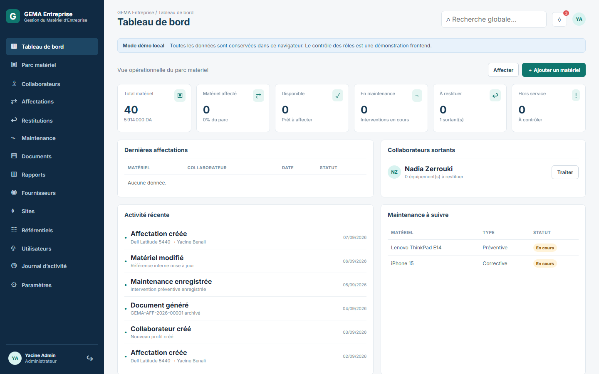
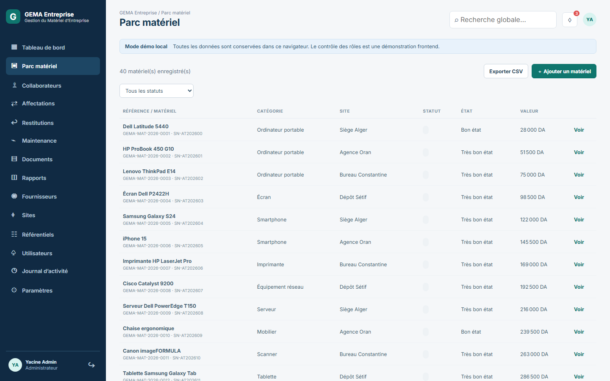

# GEMA Entreprise

**Gestion du Matériel d’Entreprise — Gérez. Affectez. Restituez.**

GEMA Entreprise est un démonstrateur/MVP frontend autonome conçu comme une application de gestion du parc matériel pour des PME et entreprises algériennes. Il transforme AssetDesk en un produit métier francophone centré sur le cycle de vie du matériel : parc, collaborateurs, affectations, maintenance, restitutions, documents et traçabilité.

> Les données affichées sont fictives. Le contrôle des rôles est une démonstration UI côté navigateur : ce projet ne prétend pas fournir une authentification sécurisée de production.

## Aperçus





## Fonctionnalités

- Tableau de bord opérationnel : disponibilité, valeurs en DA, maintenance, retours et activités.
- Parc matériel avec recherche, filtres, création, modification, archivage et code QR local.
- Collaborateurs, profils, matériel affecté, historique et parcours de départ.
- Affectations avec prévention des doubles affectations et génération d’un document.
- Restitutions avec contrôle de l’état et bascule vers disponible ou maintenance.
- Maintenance, fournisseurs, sites, catégories, kits et données de référence.
- Documents administratifs imprimables A4 : attestation, bon de remise, PV de restitution, fiches et états.
- Gestion locale des utilisateurs et démonstration RBAC.
- Journal d’activité, notifications, rapports et exports CSV des matériels.
- Persistance complète dans `localStorage`, utilisable sans API ni backend.

## Comptes de démonstration

| Rôle | E-mail | Mot de passe |
| --- | --- | --- |
| Administrateur | `admin@gema.dz` | `demo123` |
| Gestionnaire du parc | `parc@gema.dz` | `demo123` |
| Responsable RH | `rh@gema.dz` | `demo123` |
| Responsable de site | `site@gema.dz` | `demo123` |
| Collaborateur | `employe@gema.dz` | `demo123` |

## Développement local

```bash
cd frontend
npm install
npm run dev
```

Production :

```bash
npm run build
npm run preview
```

## Architecture locale

Le frontend React/Vite utilise une couche unique dans `frontend/src/dataService.js`. Les clés `gema_*` couvrent l’entreprise, les utilisateurs, collaborateurs, matériels, affectations, retours, maintenance, fournisseurs, sites, catégories, kits, documents, journal, notifications et compteurs. Les données survivent au rechargement et au redémarrage du navigateur.

## GitHub Pages

Le workflow `.github/workflows/deploy-pages.yml` construit `frontend/dist` puis le publie via GitHub Pages. Dans le dépôt GitHub, ouvrez **Settings → Pages** et choisissez **GitHub Actions** comme source. Le `base: './'` Vite rend les assets compatibles avec le sous-chemin GitHub Pages.

## Limites connues

GEMA est un MVP frontend statique : les comptes, les mots de passe et les rôles ne sont pas sécurisés côté serveur ; les données sont propres au navigateur de chaque visiteur ; le QR est un identifiant visuel local ; les documents reposent sur l’impression du navigateur plutôt que sur un service PDF.

## Attribution

Ce projet conserve la licence MIT et son avis de copyright d’origine, conformément au dépôt AssetDesk dont il est dérivé. Voir [LICENSE](LICENSE).